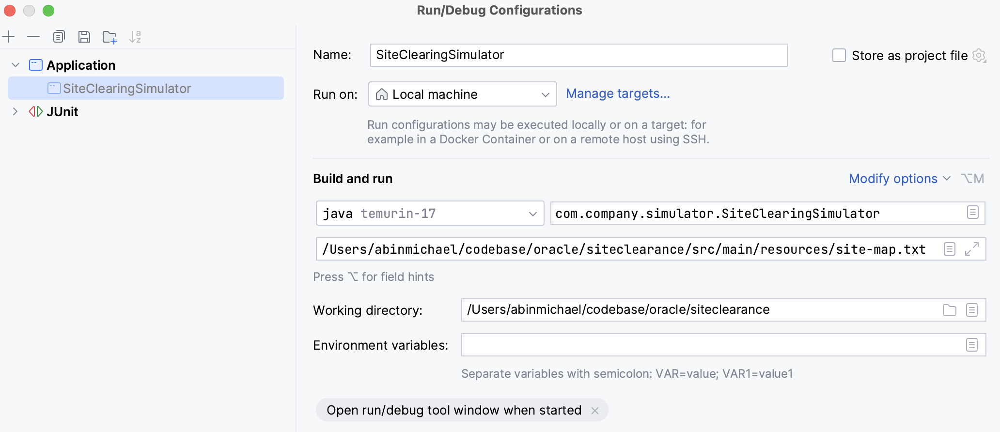
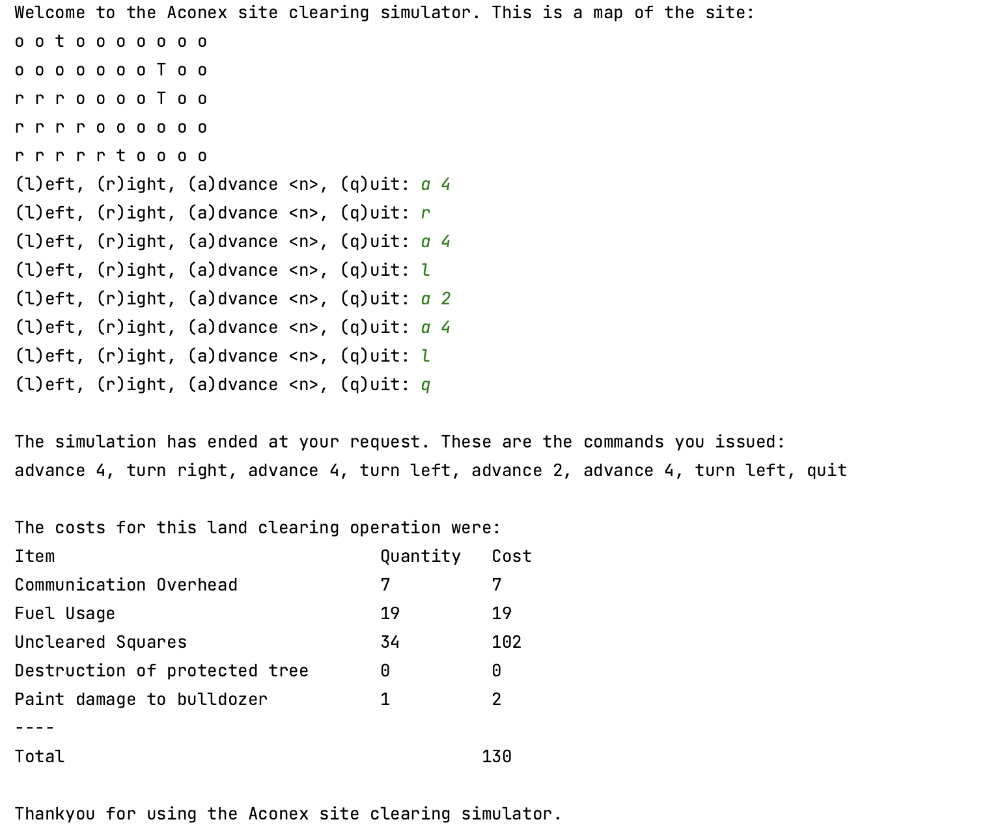

# Site clearance application

Site clearance application

## Getting Started

### Prerequisites
- Java Development Kit (JDK) 17 or later

### Running the Project

1. Navigate to the project directory:

   ```bash
   cd siteclearance
   ```

2. Build the project:

   ```bash
   mvn clean install
   ```

4. Run the project:

Run SiteClearingSimulator.java by passing the full path of the sitemap file as command line argument

eg path :- /Users/abinmichael/codebase/oracle/siteclearance/src/main/resources/site-map.txt

Sample input and output:

